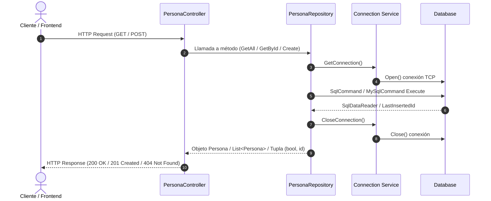

# ApiPersonas - RESTful Web API

API RESTful desarrollada en **.NET 10** con **ASP.NET Core** para la gestión y administración del ciclo de vida de registros de personas (`Persona`). El proyecto implementa una arquitectura por capas con el patrón Repository y acceso a datos relacionales mediante ADO.NET.

---

## Tabla de Contenidos

- [ApiPersonas - RESTful Web API](#apipersonas---restful-web-api)
  - [Tabla de Contenidos](#tabla-de-contenidos)
  - [Análisis General del Proyecto](#análisis-general-del-proyecto)
  - [Tecnologías y NuGets](#tecnologías-y-nugets)
    - [Dependencias Principales (NuGet Packages)](#dependencias-principales-nuget-packages)
  - [Arquitectura del Software](#arquitectura-del-software)
    - [Estructura del Proyecto](#estructura-del-proyecto)
    - [Capas de la Aplicación](#capas-de-la-aplicación)
  - [Diagramas de Flujo de Datos](#diagramas-de-flujo-de-datos)
    - [Flujo General de una Petición](#flujo-general-de-una-petición)
    - [Flujo Detallado: Creación de Persona (`POST /persona`)](#flujo-detallado-creación-de-persona-post-persona)
  - [Endpoints de la API](#endpoints-de-la-api)
    - [Ejemplos de Consumo](#ejemplos-de-consumo)
      - [1. Obtener todas las personas](#1-obtener-todas-las-personas)
      - [2. Obtener persona por ID](#2-obtener-persona-por-id)
      - [3. Crear una nueva persona](#3-crear-una-nueva-persona)
  - [Esquema de Base de Datos](#esquema-de-base-de-datos)
    - [Script MySQL](#script-mysql)
    - [Script SQL Server](#script-sql-server)
  - [Guía de Migración: De MySQL a SQL Server](#guía-de-migración-de-mysql-a-sql-server)
    - [1. ¿Cómo se PODRÍA cambiar? (Migración Directa / ADO.NET)](#1-cómo-se-podría-cambiar-migración-directa--adonet)
      - [Paso 1.1: Crear la clase de servicio para SQL Server](#paso-11-crear-la-clase-de-servicio-para-sql-server)
      - [Paso 1.2: Ajustar el Repositorio a los tipos de SQL Server](#paso-12-ajustar-el-repositorio-a-los-tipos-de-sql-server)
    - [2. ¿Cómo se DEBERÍA cambiar? (Enfoque Profesional y Buenas Prácticas)](#2-cómo-se-debería-cambiar-enfoque-profesional-y-buenas-prácticas)
      - [A. Inversión de Dependencias (Principio DIP - SOLID)](#a-inversión-de-dependencias-principio-dip---solid)
      - [B. Gestión de Cadenas de Conexión en `appsettings.json`](#b-gestión-de-cadenas-de-conexión-en-appsettingsjson)
      - [C. Inyección de Dependencias en `Program.cs`](#c-inyección-de-dependencias-en-programcs)
      - [D. Operaciones Asíncronas (`async / await`)](#d-operaciones-asíncronas-async--await)
      - [E. Alternativa con Micro-ORM (Dapper) o ORM (Entity Framework Core)](#e-alternativa-con-micro-orm-dapper-o-orm-entity-framework-core)
  - [Instalación y Ejecución Local](#instalación-y-ejecución-local)
    - [Prerrequisitos](#prerrequisitos)
    - [Pasos](#pasos)
  - [Autores](#autores)
  - [Checklist de Pasos de Desarrollo](#checklist-de-pasos-de-desarrollo)

---

## Análisis General del Proyecto

**ApiPersonas** es un servicio web backend ligero diseñado para realizar operaciones de consulta y persistencia de información de contactos/personas.

**Puntos Clave:**
- **Modelo de Dominio Sencillo:** Administra la entidad `Persona` compuesta por `Id`, `Nombre` y `Telefono`.
- **Acceso a Datos de Bajo Nivel:** Utiliza comandos SQL puros mediante ADO.NET (`MySqlCommand`, `SqlCommand`), lo que otorga control total sobre las sentencias ejecutadas y minimiza la sobrecarga de un ORM pesado.
- **Seguridad en Consultas:** Implementa consultas parametrizadas (`Parameters.AddWithValue`) para prevenir vulnerabilidades de **SQL Injection**.
- **Respuestas HTTP Estándar:** Devuelve códigos de estado semánticos (`200 OK`, `201 Created`, `400 Bad Request`, `404 Not Found`).

---

## Tecnologías y NuGets

| Componente | Tecnología / Versión | Descripción |
| :--- | :--- | :--- |
| **Runtime / SDK** | `.NET 10.0` | Versión moderna del framework de Microsoft. |
| **Framework Web** | `ASP.NET Core Web API` | Infraestructura HTTP basada en Controllers. |
| **Lenguaje** | `C# 14 / C# Latest` | Tipado estático, tuplas, inicializadores y nullable types. |
| **Base de Datos** | `MySQL / SQL Server` | Motores relacionales soportados (`db_personas`). |

### Dependencias Principales (NuGet Packages)

Definidas en [ApiPersonas.csproj](ApiPersonas/ApiPersonas.csproj):

```xml
<ItemGroup>
  <!-- Cliente oficial para conexión con Microsoft SQL Server -->
  <PackageReference Include="Microsoft.Data.SqlClient" Version="7.0.2" />
  
  <!-- Driver ADO.NET oficial para conexión con bases de datos MySQL -->
  <PackageReference Include="MySql.Data" Version="26.7.0" />
</ItemGroup>
```

---

## Arquitectura del Software

El proyecto aplica una **Arquitectura en Capas (N-Tier Architecture)** basada en el patrón **Repository**:

```
[ Cliente HTTP ]
       │  (JSON / HTTP)
       ▼
[ Controladores (Controllers) ]
       │  (Instancias de Modelo)
       ▼
[ Repositorios (Repositories) ]
       │  (Comandos SQL / ADO.NET)
       ▼
[ Servicios de Conexión (Services) ]
       │  (TCP / Sockets)
       ▼
[ Base de Datos (MySQL / SQL Server) ]
```

### Estructura del Proyecto

```
ApiPersonas/
│
├── Controllers/
│   └── PersonaController.cs          # Controlador REST con endpoints GET y POST
│
├── Models/
│   └── Persona.cs                    # Entidad de dominio (Id, Nombre, Telefono)
│
├── Repositories/
│   ├── IPersonaRepository.cs         # Interfaz para la abstracción del repositorio
│   ├── MysqlPersonaRepository.cs     # Operaciones CRUD directas con MySQL
│   └── SqlServerPersonaRepository.cs # Operaciones CRUD directas con SQL Server
│
├── services/
│   ├── mysqlConnection.cs            # Gestión de ciclo de vida de conexión MySQL
│   └── sqlServerConnection.cs        # Gestión de ciclo de vida de conexión SQL Server
│
├── appsettings.json                  # Configuración general y de logging
├── appsettings.Development.json      # Configuración para entorno de desarrollo
├── ApiPersonas.csproj                # Archivo de proyecto .NET y paquetes NuGet
├── ApiPersonas.http                  # Pruebas de integración HTTP
└── Program.cs                        # Punto de entrada de la aplicación y configuración de middleware
```

### Capas de la Aplicación

1. **Capa de Presentación / API (`Controllers/`)**:
   - [PersonaController.cs](ApiPersonas/Controllers/PersonaController.cs): Expone las rutas HTTP, recibe las peticiones, procesa los parámetros y serializa las respuestas JSON.
2. **Capa de Dominio (`Models/`)**:
   - [Persona.cs](ApiPersonas/Models/Persona.cs): Objeto plano (POCO) con propiedades `Id`, `Nombre` y `Telefono`.
3. **Capa de Persistencia / Datos (`Repositories/`)**:
   - [IPersonaRepository.cs](ApiPersonas/Repositories/IPersonaRepository.cs): Define el contrato abstracto para la gestión de personas.
   - [MysqlPersonaRepository.cs](ApiPersonas/Repositories/MysqlPersonaRepository.cs): Encapsula la lógica de acceso a datos MySQL utilizando sentencias SQL parametrizadas.
   - [SqlServerPersonaRepository.cs](ApiPersonas/Repositories/SqlServerPersonaRepository.cs): Encapsula la lógica de acceso a datos SQL Server utilizando sentencias SQL parametrizadas.
4. **Capa de Infraestructura (`services/`)**:
   - [mysqlConnection.cs](ApiPersonas/services/mysqlConnection.cs): Provee instancias de conexión para MySQL.
   - [sqlServerConnection.cs](ApiPersonas/services/sqlServerConnection.cs): Provee instancias de conexión para SQL Server.

---

## Diagramas de Flujo de Datos

### Flujo General de una Petición



### Flujo Detallado: Creación de Persona (`POST /persona`)


---

## Endpoints de la API

| Método | Ruta | Descripción | Códigos de Estado |
| :--- | :--- | :--- | :--- |
| `GET` | `/persona` | Obtiene el listado completo de personas | `200 OK` |
| `GET` | `/persona/{id}` | Obtiene una persona por su identificador | `200 OK`, `404 Not Found` |
| `POST` | `/persona` | Registra una nueva persona en la base de datos | `201 Created`, `400 Bad Request` |

> La interfaz [IPersonaRepository.cs](ApiPersonas/Repositories/IPersonaRepository.cs) incluye los métodos `Update(Persona)` y `DeleteById(long id)`, los cuales pueden ser expuestos en el controlador añadiendo las acciones correspondientes (`[HttpPut]` y `[HttpDelete("{id}"]`).

### Ejemplos de Consumo

#### 1. Obtener todas las personas
```http
GET http://localhost:5099/persona
Accept: application/json
```

#### 2. Obtener persona por ID
```http
GET http://localhost:5099/persona/1
Accept: application/json
```

#### 3. Crear una nueva persona
```http
POST http://localhost:5099/persona
Content-Type: application/json

{
  "nombre": "Davith santoyo",
  "telefono": ""
}
```

**Respuesta Exitosa (`201 Created`):**
```json
{
  "id": 1,
  "nombre": "Juan Pérez",
  "telefono": "+52 55 1234 5678"
}
```

---

## Esquema de Base de Datos

### Script MySQL

```sql
CREATE DATABASE IF NOT EXISTS db_personas;
USE db_personas;

CREATE TABLE IF NOT EXISTS personas (
    id BIGINT AUTO_INCREMENT PRIMARY KEY,
    nombre VARCHAR(150) NOT NULL,
    telefono VARCHAR(10) NULL
);
```

### Script SQL Server

```sql
CREATE DATABASE db_personas;
GO
USE db_personas;
GO

CREATE TABLE personas (
    id BIGINT IDENTITY(1,1) PRIMARY KEY,
    nombre NVARCHAR(150) NOT NULL,
    telefono NVARCHAR(10) NULL
);
GO
```

---

## Guía de Migración: De MySQL a SQL Server

El proyecto actualmente incluye la librería `Microsoft.Data.SqlClient` lista para usarse. A continuación se detallan las dos formas de realizar la migración.

---

### 1. ¿Cómo se PODRÍA cambiar? (Migración Directa / ADO.NET)

Este es el camino más directo para sustituir el motor sin cambiar la estructura existente de clases:

#### Paso 1.1: Crear la clase de servicio para SQL Server
Crear el archivo `services/sqlServerConnection.cs`:

```csharp
using Microsoft.Data.SqlClient;
using System.Data;

namespace ApiPersonas.services
{
    public class SqlServerConnection
    {
        public static readonly string connectionString = 
            "Server=localhost;Database=db_personas;Trusted_Connection=True;TrustServerCertificate=True;";
        public SqlConnection conn;

        public SqlServerConnection()
        {
            conn = new SqlConnection(connectionString);
            conn.Open();
        }

        public SqlConnection GetConnection()
        {
            if (conn.State != ConnectionState.Open)
            {
                conn.Open();
            }
            return conn;
        }

        public void CloseConnection()
        {
            conn.Close();
        }
    }
}
```

#### Paso 1.2: Ajustar el Repositorio a los tipos de SQL Server
En [SqlServerPersonaRepository.cs](ApiPersonas/Repositories/SqlServerPersonaRepository.cs):
1. Usar `using Microsoft.Data.SqlClient;`.
2. Reemplazar `MySqlCommand` por `SqlCommand` y `MySqlDataReader` por `SqlDataReader`.
3. **Diferencia Crítica en la inserción (Obtención de ID generado):**
   - En MySQL se utiliza `cmd.LastInsertedId`.
   - En SQL Server se utiliza la cláusula `OUTPUT INSERTED.id` o `SELECT SCOPE_IDENTITY();`:

```csharp
public (bool, long) Create(Persona persona)
{
    var sql = new SqlServerConnection();
    try
    {
        // Uso de OUTPUT INSERTED.id para recuperar el ID generado en SQL Server
        string query = "INSERT INTO personas (nombre, telefono) OUTPUT INSERTED.id VALUES (@nombre, @telefono)";
        using (var cmd = new SqlCommand(query, sql.conn))
        {
            cmd.Parameters.AddWithValue("@nombre", persona.Nombre);
            cmd.Parameters.AddWithValue("@telefono", (object?)persona.Telefono ?? DBNull.Value);
            
            long newId = Convert.ToInt64(cmd.ExecuteScalar());
            return (newId > 0, newId);
        }
    }
    finally
    {
        sql.CloseConnection();
    }
}
```

---

### 2. ¿Cómo se DEBERÍA cambiar? (Enfoque Profesional y Buenas Prácticas)

Para un proyecto mantenible, escalable y con arquitectura limpia, se recomienda aplicar los siguientes patrones:

#### A. Inversión de Dependencias (Principio DIP - SOLID)
Desacoplar los controladores y repositorios mediante una interfaz:

```csharp
// Repositories/IPersonaRepository.cs
public interface IPersonaRepository
{
    List<Persona> GetAll();
    Persona? GetById(long id);
    (bool success, long id) Create(Persona persona);
    bool Update(Persona persona);
    bool DeleteById(long id);
}
```

#### B. Gestión de Cadenas de Conexión en `appsettings.json`
Evitar cadenas de conexión quemadas en código fuente (*hardcoded*):

```json
{
  "ConnectionStrings": {
    "SqlServerConnection": "Server=localhost;Database=db_personas;Trusted_Connection=True;TrustServerCertificate=True;",
    "MySqlConnection": "Server=localhost;Database=db_personas;User=root;Password=;"
  }
}
```

#### C. Inyección de Dependencias en `Program.cs`
Registrar la conexión o repositorio en el contenedor de IoC de ASP.NET Core:

```csharp
// Program.cs
builder.Services.AddSingleton<IPersonaRepository, SqlServerPersonaRepository>();
```

#### D. Operaciones Asíncronas (`async / await`)
Reemplazar llamadas bloqueantes (`cmd.ExecuteReader()`) por sus equivalentes no bloqueantes (`await cmd.ExecuteReaderAsync()`) para liberar hilos del ThreadPool y soportar alta concurrencia.

#### E. Alternativa con Micro-ORM (Dapper) o ORM (Entity Framework Core)
Para cambiar de motor de forma transparente sin reescribir consultas ADO.NET manuales:
- **Dapper:** Funciona sobre la abstracción `IDbConnection` (`SqlConnection` o `MySqlConnection`).
- **EF Core:** Cambiar entre `UseSqlServer(...)` y `UseMySql(...)` mediante un solo cambio de proveedor en `Program.cs`.

---

## Instalación y Ejecución Local

### Prerrequisitos
- [.NET 10 SDK](https://dotnet.microsoft.com/) instalado.
- Servidor de base de datos MySQL (ej. XAMPP, Laragon, Docker o MySQL Server) o SQL Server según la configuración deseada.

### Pasos
1. **Clonar el repositorio:**
   ```bash
   git clone <URL_DEL_REPOSITORIO>
   cd ApiPersonas
   ```

2. **Crear la base de datos y tabla:**
   Ejecutar el script SQL correspondiente en tu motor de base de datos.

3. **Restaurar dependencias NuGet:**
   ```bash
   dotnet restore
   ```

4. **Ejecutar la API:**
   ```bash
   dotnet run
   ```

5. **Probar los endpoints:**
   Utilizar el archivo [ApiPersonas.http](ApiPersonas/ApiPersonas.http) en Visual Studio o VS Code, o herramientas como Postman / Thunder Client / Insomnia.

---

## Autores

- **[@bhusvnash](https://github.com/Bhusvnash)** - *Tasks manager.*

---

## Checklist de Pasos de Desarrollo

- [x] Definición del modelo de dominio (`Persona.cs`).
- [x] Creación de scripts de base de datos SQL (MySQL y SQL Server).
- [x] Estructuración de la arquitectura en capas (Controllers, Models, Repositories, Services).
- [x] Definición de la interfaz del repositorio (`IPersonaRepository.cs`).
- [x] Implementación de repositorios mediante ADO.NET (`MysqlPersonaRepository.cs` y `SqlServerPersonaRepository.cs`).
- [x] Creación del controlador RESTful (`PersonaController.cs`) con endpoints `GET`, `GET /{id}` y `POST`.
- [x] Configuración inicial de CORS en `Program.cs`.
- [x] Creación del archivo de pruebas de consumo HTTP (`ApiPersonas.http`).
- [ ] Implementar la lectura de variables de entorno y cadenas de conexión dinámicas en `appsettings.json` / `IConfiguration`.
- [ ] Configurar el patrón Singleton / Inyección de Dependencias para el repositorio (`IPersonaRepository`) en `Program.cs` e inyectarlo en `PersonaController`.
