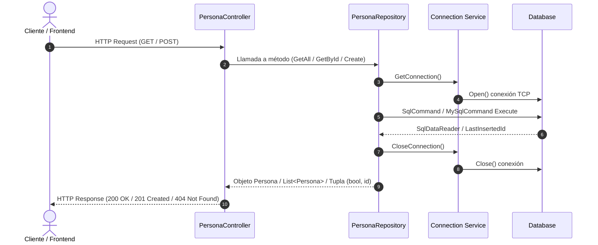
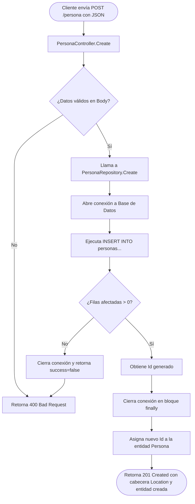

# ApiPersonas - REST

API RESTful desarrollada en **.NET 10** con **ASP.NET Core** para la gestión y administración del ciclo de vida de registros de personas (`Persona`). El proyecto implementa una arquitectura por capas con el patrón Repository y acceso a datos relacionales mediante ADO.NET.

---

## Tabla de Contenidos

- [ApiPersonas - RESTful Web API](#apipersonas---restful-web-api)
  - [Tabla de Contenidos](#tabla-de-contenidos)
  - [Análisis General del Proyecto](#análisis-general-del-proyecto)
  - [Tecnologías y NuGets](#tecnologías-y-nugets)
    - [Dependencias Principales (NuGet Packages)](#dependencias-principales-nuget-packages)
  - [Arquitectura del Software](#arquitectura-del-software)
    - [Estructura del Proyecto](#estructura-del-proyecto)
    - [Capas de la Aplicación](#capas-de-la-aplicación)
  - [Diagramas de Flujo de Datos](#diagramas-de-flujo-de-datos)
    - [Flujo General de una Petición](#flujo-general-de-una-petición)
    - [Flujo Detallado: Creación de Persona (`POST /persona`)](#flujo-detallado-creación-de-persona-post-persona)
  - [Endpoints de la API](#endpoints-de-la-api)
    - [Ejemplos de Consumo](#ejemplos-de-consumo)
      - [1. Obtener todas las personas](#1-obtener-todas-las-personas)
      - [2. Obtener persona por ID](#2-obtener-persona-por-id)
      - [3. Crear una nueva persona](#3-crear-una-nueva-persona)
  - [Esquema de Base de Datos](#esquema-de-base-de-datos)
    - [Script MySQL](#script-mysql)
    - [Script SQL Server](#script-sql-server)
  - [Instalación y Ejecución Local](#instalación-y-ejecución-local)
    - [Prerrequisitos](#prerrequisitos)
    - [Pasos](#pasos)
  - [Autores](#autores)
  - [Checklist de Pasos de Desarrollo](#checklist-de-pasos-de-desarrollo)

---

## Análisis General del Proyecto

**ApiPersonas** es un servicio web backend ligero diseñado para realizar operaciones de consulta y persistencia de información de contactos/personas.

**Puntos Clave:**
- **Modelo de Dominio Sencillo:** Administra la entidad `Persona` compuesta por `Id`, `Nombre` y `Telefono`.
- **Acceso a Datos de Bajo Nivel:** Utiliza comandos SQL puros mediante ADO.NET (`MySqlCommand`, `SqlCommand`), lo que otorga control total sobre las sentencias ejecutadas y minimiza la sobrecarga de un ORM pesado.
- **Seguridad en Consultas:** Implementa consultas parametrizadas (`Parameters.AddWithValue`) para prevenir vulnerabilidades de **SQL Injection**.
- **Respuestas HTTP Estándar:** Devuelve códigos de estado semánticos (`200 OK`, `201 Created`, `400 Bad Request`, `404 Not Found`).

---

## Tecnologías y NuGets

| Componente        | Tecnología / Versión   | Descripción                                                |
| :---------------- | :--------------------- | :--------------------------------------------------------- |
| **Runtime / SDK** | `.NET 10.0`            | Versión moderna del framework de Microsoft.                |
| **Framework Web** | `ASP.NET Core Web API` | Infraestructura HTTP basada en Controllers.                |
| **Lenguaje**      | `C# 14 / C# Latest`    | Tipado estático, tuplas, inicializadores y nullable types. |
| **Base de Datos** | `MySQL / SQL Server`   | Motores relacionales soportados (`db_personas`).           |

### Dependencias Principales (NuGet Packages)

Definidas en [ApiPersonas.csproj](ApiPersonas/ApiPersonas.csproj):

```xml
<ItemGroup>
  <!-- Cliente oficial para conexión con Microsoft SQL Server -->
  <PackageReference Include="Microsoft.Data.SqlClient" Version="7.0.2" />
  
  <!-- Driver ADO.NET oficial para conexión con bases de datos MySQL -->
  <PackageReference Include="MySql.Data" Version="26.7.0" />
</ItemGroup>
```

---

## Arquitectura del Software

El proyecto aplica una **Arquitectura en Capas (N-Tier Architecture)** basada en el patrón **Repository**:

```
[ Cliente HTTP ]
       │  (JSON / HTTP)
       ▼
[ Controladores (Controllers) ]
       │  (Instancias de Modelo)
       ▼
[ Repositorios (Repositories) ]
       │  (Comandos SQL / ADO.NET)
       ▼
[ Servicios de Conexión (Services) ]
       │  (TCP / Sockets)
       ▼
[ Base de Datos (MySQL / SQL Server) ]
```

### Estructura del Proyecto

```
ApiPersonas/
│
├── Controllers/
│   └── PersonaController.cs          # Controlador REST con endpoints GET y POST
│
├── Models/
│   └── Persona.cs                    # Entidad de dominio (Id, Nombre, Telefono)
│
├── Repositories/
│   ├── IPersonaRepository.cs         # Interfaz para la abstracción del repositorio
│   ├── MysqlPersonaRepository.cs     # Operaciones CRUD directas con MySQL
│   └── SqlServerPersonaRepository.cs # Operaciones CRUD directas con SQL Server
│
├── services/
│   ├── mysqlConnection.cs            # Gestión de ciclo de vida de conexión MySQL
│   └── sqlServerConnection.cs        # Gestión de ciclo de vida de conexión SQL Server
│
├── appsettings.json                  # Configuración general y de logging
├── appsettings.Development.json      # Configuración para entorno de desarrollo
├── ApiPersonas.csproj                # Archivo de proyecto .NET y paquetes NuGet
├── ApiPersonas.http                  # Pruebas de integración HTTP
└── Program.cs                        # Punto de entrada de la aplicación y configuración de middleware
```

### Capas de la Aplicación

1. **Capa de Presentación / API (`Controllers/`)**:
   - [PersonaController.cs](ApiPersonas/Controllers/PersonaController.cs): Expone las rutas HTTP, recibe las peticiones, procesa los parámetros y serializa las respuestas JSON.
2. **Capa de Dominio (`Models/`)**:
   - [Persona.cs](ApiPersonas/Models/Persona.cs): Objeto plano (POCO) con propiedades `Id`, `Nombre` y `Telefono`.
3. **Capa de Persistencia / Datos (`Repositories/`)**:
   - [IPersonaRepository.cs](ApiPersonas/Repositories/IPersonaRepository.cs): Define el contrato abstracto para la gestión de personas.
   - [MysqlPersonaRepository.cs](ApiPersonas/Repositories/MysqlPersonaRepository.cs): Encapsula la lógica de acceso a datos MySQL utilizando sentencias SQL parametrizadas.
   - [SqlServerPersonaRepository.cs](ApiPersonas/Repositories/SqlServerPersonaRepository.cs): Encapsula la lógica de acceso a datos SQL Server utilizando sentencias SQL parametrizadas.
4. **Capa de Infraestructura (`services/`)**:
   - [mysqlConnection.cs](ApiPersonas/services/mysqlConnection.cs): Provee instancias de conexión para MySQL.
   - [sqlServerConnection.cs](ApiPersonas/services/sqlServerConnection.cs): Provee instancias de conexión para SQL Server.

---

## Diagramas de Flujo de Datos

### Flujo General de una Petición



### Flujo Detallado: Creación de Persona (`POST /persona`)



---

## Endpoints de la API

| Método | Ruta            | Descripción                                    | Códigos de Estado                |
| :----- | :-------------- | :--------------------------------------------- | :------------------------------- |
| `GET`    | `/`             | Sirve la interfaz web estática (`index.html`) | `200 OK`, `404 Not Found`        |
| `GET`    | `/persona`      | Obtiene el listado completo de personas        | `200 OK`                         |
| `GET`    | `/persona/{id}` | Obtiene una persona por su identificador       | `200 OK`, `404 Not Found`        |
| `POST`   | `/persona`      | Registra una nueva persona en la base de datos | `201 Created`, `400 Bad Request` |
| `PUT`    | `/persona/{id}` | Actualiza los datos de una persona existente   | `204 NoContent`, `400 Bad Request`, `404 Not Found` |
| `DELETE` | `/persona/{id}` | Elimina una persona por su identificador       | `204 NoContent`, `404 Not Found` |

### Ejemplos de Consumo

#### 1. Obtener todas las personas
```http
GET http://localhost:5099/persona
Accept: application/json
```

#### 2. Obtener persona por ID
```http
GET http://localhost:5099/persona/1
Accept: application/json
```

#### 3. Crear una nueva persona
```http
POST http://localhost:5099/persona
Content-Type: application/json

{
  "nombre": "Davith santoyo",
  "telefono": "3001234567"
}
```

#### 4. Actualizar una persona
```http
PUT http://localhost:5099/persona/1
Content-Type: application/json

{
  "id": 1,
  "nombre": "Davith Santoyo Actualizado",
  "telefono": "3009876543"
}
```

#### 5. Eliminar una persona
```http
DELETE http://localhost:5099/persona/1
```

---

## Interfaz Web de Usuario (`wwwroot/`)

El proyecto incluye un cliente web ligero servido directamente por ASP.NET Core (`app.UseStaticFiles()`) para consumir y probar la API de forma interactiva.

### Estructura de Frontend
```
wwwroot/
│
├── index.html                     # Vista principal (Bootstrap 5, tabla, modal y buscador)
└── assets/
    ├── css/
    │   ├── bootstrap.min.css      # Framework de estilos CSS
    │   └── style.css              # Estilos personalizados adicionales
    └── Js/
        ├── app.js                 # Lógica de renderizado DOM, modales y eventos
        ├── crud.js                # Funciones de comunicación HTTP con la API (fetch)
        └── bootstrap.bundle.min.js# JavaScript de Bootstrap
```

---

## Esquema de Base de Datos

### Script MySQL

```sql
CREATE DATABASE IF NOT EXISTS db_personas;
USE db_personas;

CREATE TABLE IF NOT EXISTS personas (
    id BIGINT AUTO_INCREMENT PRIMARY KEY,
    nombre VARCHAR(150) NOT NULL,
    telefono VARCHAR(10) NULL
);
```

### Script SQL Server

```sql
CREATE DATABASE db_personas;
GO
USE db_personas;
GO

CREATE TABLE personas (
    id BIGINT IDENTITY(1,1) PRIMARY KEY,
    nombre NVARCHAR(150) NOT NULL,
    telefono NVARCHAR(10) NULL
);
GO
```

---

## Instalación y Ejecución Local

### Prerrequisitos
- [.NET 10 SDK](https://dotnet.microsoft.com/) instalado.
- Servidor de base de datos MySQL (ej. XAMPP, Laragon, Docker o MySQL Server) o SQL Server según la configuración deseada.

### Pasos
1. **Clonar el repositorio:**
   ```bash
   git clone https://github.com/Bhusvnash/ApiPersona.git
   cd ApiPersonas
   ```

2. **Crear la base de datos y tabla:**
   Ejecutar el script SQL correspondiente en tu motor de base de datos.

3. **Restaurar dependencias NuGet:**
   ```bash
   dotnet restore
   ```

4. **Ejecutar la API:**
   ```bash
   dotnet run
   ```

5. **Acceder a la aplicación:**
   - **Frontend / GUI Web:** Abrir en el navegador `http://localhost:5099/`
   - **Endpoints REST:** Probar con el archivo [ApiPersonas.http](ApiPersonas.http) o herramientas como Postman / Bruno / Thunder Client.

---

## Autores

- **[@bhusvnash](https://github.com/Bhusvnash)** - *Tasks manager.*

---

## Estado del Proyecto y Checklist de Tareas

### Backend (API REST)
- [x] Definición del modelo de dominio ([Persona.cs](Models/Persona.cs)).
- [x] Creación de scripts de base de datos SQL (MySQL y SQL Server).
- [x] Estructuración de la arquitectura en capas (Controllers, Models, Repositories, Services).
- [x] Definición de la interfaz del repositorio ([IPersonaRepository.cs](Repositories/IPersonaRepository.cs)).
- [x] Implementación de repositorios ADO.NET ([MysqlPersonaRepository.cs](Repositories/MysqlPersonaRepository.cs) y [SqlServerPersonaRepository.cs](Repositories/SqlServerPersonaRepository.cs)).
- [x] Inyección de Dependencias para `IPersonaRepository` en [Program.cs](Program.cs) hacia [PersonaController.cs](Controllers/PersonaController.cs).
- [x] Controlador RESTful completo (`GET /`, `GET /persona`, `GET /persona/{id}`, `POST /persona`, `PUT /persona/{id}`, `DELETE /persona/{id}`).
- [x] Middleware personalizado de registro/logging de peticiones en consola.
- [x] Configuración de CORS y middleware para servir archivos estáticos (`UseStaticFiles`).
- [ ] Mover cadenas de conexión fijas a `appsettings.json` e inyectar `IConfiguration`.

### Frontend / Cliente Web (`wwwroot/`) — Lista de lo que falta por implementar
- [x] Estructura HTML base con Bootstrap 5 dark theme ([index.html](wwwroot/index.html)).
- [x] Carga inicial de datos desde la API (`getAll()`).
- [ ] **Completar creación de personas en [app.js](wwwroot/assets/Js/app.js):**
  - Implementar la llamada a `create(data)` al hacer submit en el modal.
  - Limpiar el formulario, cerrar el modal (`modal.instance.hide()`) y recargar la tabla (`cargar()`).
- [ ] **Corregir métodos en [crud.js](wwwroot/assets/Js/crud.js):**
  - Corregir `create()`: Cambiar `"method": "Delete"` por `"method": "POST"`.
  - Corregir cabecera `"Content - Type"` por `"Content-Type"` en `create()` y `update()`.
  - Implementar la función `remove(id)` / `deleteById(id)` con llamada `DELETE` hacia `${url}/${id}`.
- [ ] **Implementar funcionalidad de Edición:**
  - Agregar listener de eventos para botones `[data-edit]` en la tabla.
  - Cargar datos de la persona en el modal (mediante `getById` o datos en memoria).
  - Enviar petición `update(id, persona)` y refrescar la tabla.
- [ ] **Implementar funcionalidad de Eliminación:**
  - Agregar listener de eventos para botones `[data-delete]` en la tabla.
  - Modal o alerta de confirmación previa a la eliminación.
  - Llamada a endpoint `DELETE /persona/{id}` y refrescar la tabla.
- [ ] **Implementar filtro y búsqueda en tiempo real:**
  - Vincular `#inputFilter` para filtrar la tabla por ID o por coincidencia en el nombre.
- [ ] **Feedback visual y validaciones:**
  - Mensajes de alerta (toasts o alerts de Bootstrap) para operaciones exitosas o errores de red.
  - Validación de campos requeridos (`nombre` obligatorio, formato de `telefono`).
