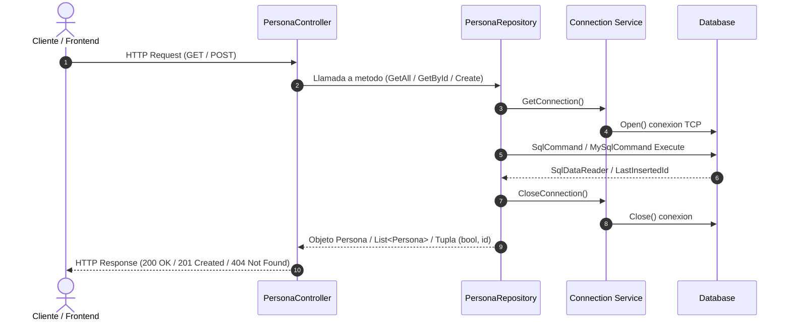
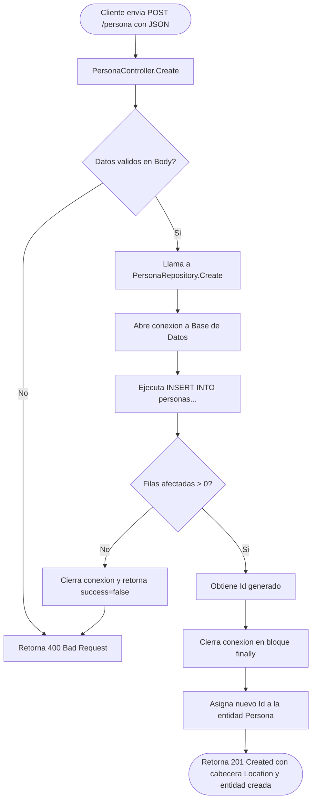
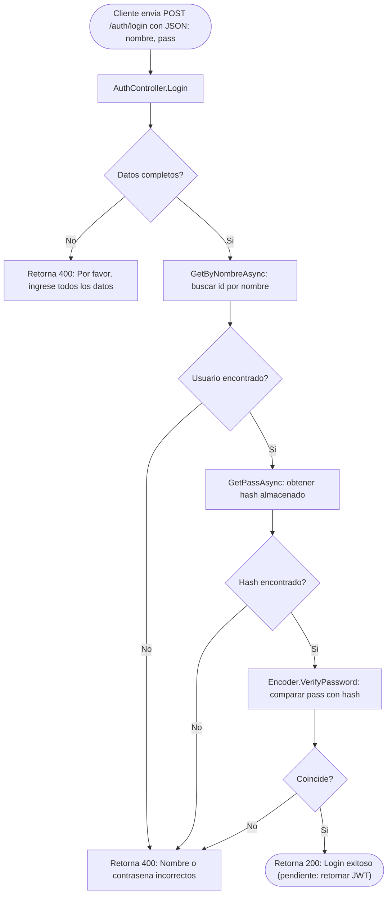

# ApiPersonas - REST

API RESTful desarrollada en **.NET 10** con **ASP.NET Core** para la gestion y administracion de registros de personas y usuarios con autenticacion. El proyecto implementa una arquitectura por capas con el patron Repository, acceso a datos relacionales mediante ADO.NET, hashing de contrasenas con BCrypt y un sistema de autenticacion basado en login con verificacion de credenciales.

---

## Tabla de Contenidos

- [Analisis General del Proyecto](#analisis-general-del-proyecto)
- [Tecnologias y NuGets](#tecnologias-y-nugets)
  - [Dependencias Principales (NuGet Packages)](#dependencias-principales-nuget-packages)
- [Arquitectura del Software](#arquitectura-del-software)
  - [Estructura del Proyecto](#estructura-del-proyecto)
  - [Capas de la Aplicacion](#capas-de-la-aplicacion)
- [Modelos y DTOs](#modelos-y-dtos)
- [Diagramas de Flujo de Datos](#diagramas-de-flujo-de-datos)
  - [Flujo General de una Peticion](#flujo-general-de-una-peticion)
  - [Flujo Detallado: Creacion de Persona (POST /persona)](#flujo-detallado-creacion-de-persona-post-persona)
  - [Flujo de Autenticacion: Login (POST /auth/login)](#flujo-de-autenticacion-login-post-authlogin)
- [Endpoints de la API](#endpoints-de-la-api)
  - [Persona](#persona)
  - [Usuario](#usuario)
  - [Auth](#auth)
  - [Ejemplos de Consumo](#ejemplos-de-consumo)
- [Esquema de Base de Datos](#esquema-de-base-de-datos)
  - [Script MySQL](#script-mysql)
  - [Script SQL Server](#script-sql-server)
- [Interfaz Web de Usuario (wwwroot/)](#interfaz-web-de-usuario-wwwroot)
- [Instalacion y Ejecucion Local](#instalacion-y-ejecucion-local)
- [Autores](#autores)
- [Estado del Proyecto y Checklist de Tareas](#estado-del-proyecto-y-checklist-de-tareas)

---

## Analisis General del Proyecto

**ApiPersonas** es un servicio web backend que gestiona dos dominios principales: contactos/personas y usuarios con autenticacion.

**Puntos Clave:**
- **Dos Dominios:** Administra la entidad `Persona` (Id, Nombre, Telefono) y la entidad `Usuario` mediante DTOs (`GetUsuario` para recibir datos, `SendUsuario` para responder sin exponer la contrasena).
- **Patron DTO (Data Transfer Object):** El modulo de usuarios utiliza records de C# como DTOs para separar la entrada de datos (`GetUsuario`: Nombre, Pass) de la salida (`SendUsuario`: Id, Nombre), evitando la exposicion de campos sensibles.
- **Hashing de Contrasenas:** Las contrasenas se almacenan como hashes BCrypt generados por el servicio `Encoder`, nunca en texto plano.
- **Autenticacion:** El `AuthController` implementa un flujo de login que valida credenciales contra el hash almacenado en base de datos.
- **Acceso a Datos de Bajo Nivel:** Utiliza comandos SQL puros mediante ADO.NET (`MySqlCommand`, `SqlCommand`), lo que otorga control total sobre las sentencias ejecutadas y minimiza la sobrecarga de un ORM pesado.
- **Seguridad en Consultas:** Implementa consultas parametrizadas (`Parameters.AddWithValue`) para prevenir vulnerabilidades de **SQL Injection**.
- **Respuestas HTTP Estandar:** Devuelve codigos de estado semanticos (`200 OK`, `201 Created`, `400 Bad Request`, `404 Not Found`, `500 Internal Server Error`).

---

## Tecnologias y NuGets

| Componente        | Tecnologia / Version   | Descripcion                                                |
| :---------------- | :--------------------- | :--------------------------------------------------------- |
| **Runtime / SDK** | `.NET 10.0`            | Version moderna del framework de Microsoft.                |
| **Framework Web** | `ASP.NET Core Web API` | Infraestructura HTTP basada en Controllers.                |
| **Lenguaje**      | `C# 14 / C# Latest`   | Tipado estatico, records, tuplas y nullable types.         |
| **Base de Datos** | `MySQL / SQL Server`   | Motores relacionales soportados (`db_personas`).           |
| **Hashing**       | `BCrypt.Net-Next`      | Generacion y verificacion de hashes de contrasenas.        |

### Dependencias Principales (NuGet Packages)

Definidas en [ApiPersonas.csproj](ApiPersonas.csproj):

```xml
<ItemGroup>
  <!-- Cliente oficial para conexion con Microsoft SQL Server -->
  <PackageReference Include="Microsoft.Data.SqlClient" Version="7.0.2" />
  
  <!-- Driver ADO.NET oficial para conexion con bases de datos MySQL -->
  <PackageReference Include="MySql.Data" Version="26.7.0" />

  <!-- Libreria para hashing de contrasenas con BCrypt -->
  <PackageReference Include="BCrypt.Net-Next" Version="4.2.0" />
</ItemGroup>
```

---

## Arquitectura del Software

El proyecto aplica una **Arquitectura en Capas (N-Tier Architecture)** basada en el patron **Repository**:

```
[ Cliente HTTP ]
       |  (JSON / HTTP)
       v
[ Controladores (Controllers) ]
  PersonaController | UsuarioController | AuthController
       |  (DTOs / Modelos)
       v
[ Repositorios (Repositories) ]
  IPersonaRepository | IUsuarioRepository
       |  (Comandos SQL / ADO.NET)
       v
[ Servicios (Services) ]
  MysqlConnection | sqlServerConnection | Encoder
       |  (TCP / Sockets / BCrypt)
       v
[ Base de Datos (MySQL / SQL Server) ]
```

### Estructura del Proyecto

```
ApiPersonas/
|
+-- Controllers/
|   +-- PersonaController.cs          # Controlador REST para personas (GET, POST, PUT, DELETE)
|   +-- UsuarioController.cs          # Controlador REST para usuarios (CRUD con hashing)
|   +-- AuthController.cs             # Controlador de autenticacion (login)
|
+-- Models/
|   +-- Persona.cs                    # Entidad de dominio (Id, Nombre, Telefono)
|   +-- Usuario.cs                    # DTOs: GetUsuario(Nombre, Pass) y SendUsuario(Id, Nombre)
|
+-- Repositories/
|   +-- IPersonaRepository.cs         # Interfaz para la abstraccion del repositorio de personas
|   +-- MysqlPersonaRepository.cs     # Operaciones CRUD directas con MySQL (personas)
|   +-- SqlServerPersonaRepository.cs # Operaciones CRUD directas con SQL Server (personas)
|   +-- IUsarioRepository.cs          # Interfaz para la abstraccion del repositorio de usuarios
|   +-- MysqlUsuarioRepository.cs     # Operaciones CRUD directas con MySQL (usuarios)
|   +-- SqlServerUsuarioRepository.cs # Operaciones CRUD directas con SQL Server (usuarios)
|
+-- services/
|   +-- mysqlConnection.cs            # Gestion de ciclo de vida de conexion MySQL
|   +-- sqlServerConnection.cs        # Gestion de ciclo de vida de conexion SQL Server
|   +-- encoder.cs                    # Hashing y verificacion de contrasenas con BCrypt
|
+-- wwwroot/
|   +-- index.html                    # Vista principal (Bootstrap 5, tabla, modal y buscador)
|   +-- auth/
|   |   +-- login.html                # Pagina de login (pendiente)
|   +-- assets/
|       +-- css/                      # Estilos CSS (Bootstrap + personalizados)
|       +-- Js/                       # Logica de frontend (app.js, crud.js, bootstrap)
|
+-- appsettings.json                  # Configuracion general y de logging
+-- ApiPersonas.csproj                # Archivo de proyecto .NET y paquetes NuGet
+-- ApiPersonas.http                  # Pruebas de integracion HTTP
+-- Program.cs                        # Punto de entrada, DI, middleware y configuracion
```

### Capas de la Aplicacion

1. **Capa de Presentacion / API (`Controllers/`)**:
   - [PersonaController.cs](Controllers/PersonaController.cs): Expone las rutas HTTP para CRUD de personas, recibe peticiones y serializa respuestas JSON.
   - [UsuarioController.cs](Controllers/UsuarioController.cs): Expone las rutas HTTP para CRUD de usuarios, hashea contrasenas antes de persistir y retorna DTOs `SendUsuario` (sin contrasena).
   - [AuthController.cs](Controllers/AuthController.cs): Implementa el flujo de login validando credenciales contra el hash BCrypt almacenado.
2. **Capa de Dominio (`Models/`)**:
   - [Persona.cs](Models/Persona.cs): Clase POCO con propiedades `Id`, `Nombre` y `Telefono`.
   - [Usuario.cs](Models/Usuario.cs): Records inmutables que funcionan como DTOs:
     - `GetUsuario(string Nombre, string Pass)` -- recibe datos de entrada (POST/PUT).
     - `SendUsuario(long Id, string Nombre)` -- responde datos de salida (GET), sin exponer la contrasena.
3. **Capa de Persistencia / Datos (`Repositories/`)**:
   - [IPersonaRepository.cs](Repositories/IPersonaRepository.cs): Contrato abstracto para personas.
   - [IUsarioRepository.cs](Repositories/IUsarioRepository.cs): Contrato abstracto para usuarios, incluye `GetByNombreAsync` y `GetPassAsync` para el flujo de autenticacion.
   - Implementaciones MySQL y SQL Server para ambos repositorios con sentencias SQL parametrizadas.
4. **Capa de Infraestructura (`services/`)**:
   - [mysqlConnection.cs](services/mysqlConnection.cs): Provee instancias de conexion para MySQL.
   - [sqlServerConnection.cs](services/sqlServerConnection.cs): Provee instancias de conexion para SQL Server.
   - [encoder.cs](services/encoder.cs): Servicio estatico con `HashPassword()` y `VerifyPassword()` usando BCrypt.

---

## Modelos y DTOs

### Persona (Clase POCO)

```csharp
public class Persona
{
    public long? Id { get; set; }
    public string? Nombre { get; set; }
    public string? Telefono { get; set; }
}
```

### Usuario (Records / DTOs)

```csharp
// DTO de entrada: datos que el cliente envia al servidor
public record GetUsuario(string Nombre, string Pass);

// DTO de salida: datos que el servidor responde al cliente (sin contrasena)
public record SendUsuario(long Id, string Nombre);
```

La separacion en DTOs evita que la contrasena (ni siquiera el hash) se exponga en las respuestas de la API.

---

## Diagramas de Flujo de Datos

### Flujo General de una Peticion


```mermaid
sequenceDiagram
    autonumber
    actor Cliente as Cliente / Frontend
    participant Controller as PersonaController
    participant Repo as PersonaRepository
    participant Service as Connection Service
    participant DB as Database

    Cliente->>Controller: HTTP Request (GET / POST)
    Controller->>Repo: Llamada a metodo (GetAll / GetById / Create)
    Repo->>Service: GetConnection()
    Service->>DB: Open() conexion TCP
    Repo->>DB: SqlCommand / MySqlCommand Execute
    DB-->>Repo: SqlDataReader / LastInsertedId
    Repo->>Service: CloseConnection()
    Service->>DB: Close() conexion
    Repo-->>Controller: Objeto Persona / List<Persona> / Tupla (bool, id)
    Controller-->>Cliente: HTTP Response (200 OK / 201 Created / 404 Not Found)
```

### Flujo Detallado: Creacion de Persona (`POST /persona`)


```mermaid
flowchart TD
    A(["Cliente envia POST /persona con JSON"]) --> B["PersonaController.Create"]
    B --> C{"Datos validos en Body?"}
    C -- No --> D["Retorna 400 Bad Request"]
    C -- Si --> E["Llama a PersonaRepository.Create"]
    E --> F["Abre conexion a Base de Datos"]
    F --> G["Ejecuta INSERT INTO personas..."]
    G --> H{"Filas afectadas > 0?"}
    H -- No --> I["Cierra conexion y retorna success=false"]
    I --> D
    H -- Si --> J["Obtiene Id generado"]
    J --> K["Cierra conexion en bloque finally"]
    K --> L["Asigna nuevo Id a la entidad Persona"]
    L --> M(["Retorna 201 Created con cabecera Location y entidad creada"])
```

### Flujo de Autenticacion: Login (`POST /auth/login`)


```mermaid
flowchart TD
    A(["Cliente envia POST /auth/login con JSON: nombre, pass"]) --> B["AuthController.Login"]
    B --> C{"Datos completos?"}
    C -- No --> D["Retorna 400: Por favor, ingrese todos los datos"]
    C -- Si --> E["GetByNombreAsync: buscar id por nombre"]
    E --> F{"Usuario encontrado?"}
    F -- No --> G["Retorna 400: Nombre o contrasena incorrectos"]
    F -- Si --> H["GetPassAsync: obtener hash almacenado"]
    H --> I{"Hash encontrado?"}
    I -- No --> G
    I -- Si --> J["Encoder.VerifyPassword: comparar pass con hash"]
    J --> K{"Coincide?"}
    K -- No --> G
    K -- Si --> L(["Retorna 200: Login exitoso (pendiente: retornar JWT)"])
```

---

## Endpoints de la API

### Persona

| Metodo   | Ruta              | Descripcion                                    | Codigos de Estado                                  |
| :------- | :---------------- | :--------------------------------------------- | :------------------------------------------------- |
| `GET`    | `/index`          | Sirve la interfaz web estatica (`index.html`)  | `200 OK`, `404 Not Found`                          |
| `GET`    | `/persona`        | Obtiene el listado completo de personas        | `200 OK`                                           |
| `GET`    | `/persona/{id}`   | Obtiene una persona por su identificador       | `200 OK`, `404 Not Found`                          |
| `POST`   | `/persona`        | Registra una nueva persona                     | `201 Created`, `400 Bad Request`                   |
| `PUT`    | `/persona/{id}`   | Actualiza los datos de una persona existente   | `204 NoContent`, `400 Bad Request`, `404 Not Found`|
| `DELETE` | `/persona/{id}`   | Elimina una persona por su identificador       | `204 NoContent`, `404 Not Found`                   |

### Usuario

| Metodo   | Ruta              | Descripcion                                    | Codigos de Estado                                  |
| :------- | :---------------- | :--------------------------------------------- | :------------------------------------------------- |
| `GET`    | `/usuario`        | Lista todos los usuarios (`SendUsuario[]`)     | `200 OK`, `500 Internal Server Error`              |
| `GET`    | `/usuario/{id}`   | Obtiene un usuario por id (`SendUsuario`)      | `200 OK`, `400 Bad Request`, `404 Not Found`, `500`|
| `POST`   | `/usuario`        | Crea un usuario (hashea pass con BCrypt)       | `201 Created`, `500 Internal Server Error`         |
| `PUT`    | `/usuario/{id}`   | Actualiza nombre y contrasena de un usuario    | `200 OK`, `400 Bad Request`, `500`                 |
| `DELETE` | `/usuario/{id}`   | Elimina un usuario por su identificador        | `204 NoContent`, `400 Bad Request`, `500`          |

### Auth

| Metodo   | Ruta              | Descripcion                                    | Codigos de Estado                                  |
| :------- | :---------------- | :--------------------------------------------- | :------------------------------------------------- |
| `POST`   | `/auth/login`     | Valida credenciales contra hash BCrypt         | `200 OK`, `400 Bad Request`                        |
| `GET`    | `/`               | Redirige a `/auth/login.html`                  | `302 Redirect`                                     |

### Ejemplos de Consumo

#### 1. Obtener todas las personas
```http
GET http://localhost:5099/persona
Accept: application/json
```

#### 2. Obtener persona por ID
```http
GET http://localhost:5099/persona/1
Accept: application/json
```

#### 3. Crear una nueva persona
```http
POST http://localhost:5099/persona
Content-Type: application/json

{
  "nombre": "Davith santoyo",
  "telefono": "3001234567"
}
```

#### 4. Actualizar una persona
```http
PUT http://localhost:5099/persona/1
Content-Type: application/json

{
  "id": 1,
  "nombre": "Davith Santoyo Actualizado",
  "telefono": "3009876543"
}
```

#### 5. Eliminar una persona
```http
DELETE http://localhost:5099/persona/1
```

#### 6. Crear un usuario
```http
POST http://localhost:5099/usuario
Content-Type: application/json

{
  "nombre": "admin",
  "pass": "mi_contrasena_segura"
}
```

#### 7. Login
```http
POST http://localhost:5099/auth/login
Content-Type: application/json

{
  "nombre": "admin",
  "pass": "mi_contrasena_segura"
}
```

---

## Esquema de Base de Datos

### Script MySQL

```sql
CREATE DATABASE IF NOT EXISTS db_personas;
USE db_personas;

-- Tabla de contactos/personas
CREATE TABLE IF NOT EXISTS personas (
    id BIGINT AUTO_INCREMENT PRIMARY KEY,
    nombre VARCHAR(150) NOT NULL,
    telefono VARCHAR(10) NULL
);

-- Tabla de usuarios para autenticacion
CREATE TABLE IF NOT EXISTS usuario (
    id BIGINT AUTO_INCREMENT PRIMARY KEY,
    nombre VARCHAR(150) NOT NULL UNIQUE,
    pass VARCHAR(255) NOT NULL
);
```

### Script SQL Server

```sql
CREATE DATABASE db_personas;
GO
USE db_personas;
GO

-- Tabla de contactos/personas
CREATE TABLE personas (
    id BIGINT IDENTITY(1,1) PRIMARY KEY,
    nombre NVARCHAR(150) NOT NULL,
    telefono NVARCHAR(10) NULL
);
GO

-- Tabla de usuarios para autenticacion
CREATE TABLE usuario (
    id BIGINT IDENTITY(1,1) PRIMARY KEY,
    nombre NVARCHAR(150) NOT NULL UNIQUE,
    pass NVARCHAR(255) NOT NULL
);
GO
```

**Notas sobre la tabla `usuario`:**
- `id`: Clave primaria auto-incremental (`AUTO_INCREMENT` en MySQL, `IDENTITY(1,1)` en SQL Server).
- `nombre`: Restriccion `UNIQUE` que impide usuarios duplicados y permite la busqueda por nombre en el login.
- `pass`: Almacena el hash BCrypt de la contrasena (nunca texto plano). El tamano `VARCHAR(255)` es necesario para acomodar los hashes BCrypt que tienen ~60 caracteres.

---

## Interfaz Web de Usuario (`wwwroot/`)

El proyecto incluye un cliente web ligero servido directamente por ASP.NET Core (`app.UseStaticFiles()`) para consumir y probar la API de forma interactiva.

### Estructura de Frontend
```
wwwroot/
|
+-- index.html                     # Vista principal (Bootstrap 5, tabla, modal y buscador)
+-- auth/
|   +-- login.html                 # Pagina de login (pendiente de implementacion)
+-- assets/
    +-- css/
    |   +-- bootstrap.min.css      # Framework de estilos CSS
    |   +-- style.css              # Estilos personalizados adicionales
    +-- Js/
        +-- app.js                 # Logica de renderizado DOM, modales y eventos
        +-- crud.js                # Funciones de comunicacion HTTP con la API (fetch)
        +-- bootstrap.bundle.min.js# JavaScript de Bootstrap
```

---

## Instalacion y Ejecucion Local

### Prerrequisitos
- [.NET 10 SDK](https://dotnet.microsoft.com/) instalado.
- Servidor de base de datos MySQL (ej. XAMPP, Laragon, Docker o MySQL Server) o SQL Server segun la configuracion deseada.

### Pasos
1. **Clonar el repositorio:**
   ```bash
   git clone https://github.com/Bhusvnash/ApiPersona.git
   cd ApiPersonas
   ```

2. **Crear la base de datos y tablas:**
   Ejecutar los scripts SQL correspondientes (seccion [Esquema de Base de Datos](#esquema-de-base-de-datos)) en tu motor de base de datos. Asegurarse de crear tanto la tabla `personas` como la tabla `usuario`.

3. **Restaurar dependencias NuGet:**
   ```bash
   dotnet restore
   ```

4. **Ejecutar la API:**
   ```bash
   dotnet run
   ```

5. **Acceder a la aplicacion:**
   - **Frontend / GUI Web:** Abrir en el navegador `http://localhost:5099/`
   - **Endpoints REST:** Probar con el archivo [ApiPersonas.http](ApiPersonas.http) o herramientas como Postman / Bruno / Thunder Client.

---

## Autores

- **[@bhusvnash](https://github.com/Bhusvnash)** - *Tasks manager.*

---

## Estado del Proyecto y Checklist de Tareas

### Backend - Modulo Persona (API REST)
- [x] Definicion del modelo de dominio ([Persona.cs](Models/Persona.cs)).
- [x] Creacion de scripts de base de datos SQL (MySQL y SQL Server).
- [x] Estructuracion de la arquitectura en capas (Controllers, Models, Repositories, Services).
- [x] Definicion de la interfaz del repositorio ([IPersonaRepository.cs](Repositories/IPersonaRepository.cs)).
- [x] Implementacion de repositorios ADO.NET ([MysqlPersonaRepository.cs](Repositories/MysqlPersonaRepository.cs) y [SqlServerPersonaRepository.cs](Repositories/SqlServerPersonaRepository.cs)).
- [x] Inyeccion de Dependencias para `IPersonaRepository` en [Program.cs](Program.cs).
- [x] Controlador RESTful completo (`GET /index`, `GET /persona`, `GET /persona/{id}`, `POST /persona`, `PUT /persona/{id}`, `DELETE /persona/{id}`).
- [x] Middleware personalizado de registro/logging de peticiones en consola.
- [x] Configuracion de CORS y middleware para servir archivos estaticos (`UseStaticFiles`).
- [ ] Mover cadenas de conexion fijas a `appsettings.json` e inyectar `IConfiguration`.

### Backend - Modulo Usuario
- [x] DTOs con records de C#: `GetUsuario(Nombre, Pass)` y `SendUsuario(Id, Nombre)`.
- [x] Interfaz `IUsuarioRepository` con metodos CRUD + `GetByNombreAsync` + `GetPassAsync`.
- [x] Implementacion `MysqlUsuarioRepository` con todos los metodos.
- [x] Implementacion `SqlServerUsuarioRepository` con todos los metodos.
- [x] Hashing de contrasenas con `Encoder.HashPassword()` en ambos repositorios.
- [x] Inyeccion de Dependencias para `IUsuarioRepository` en [Program.cs](Program.cs).
- [x] `UsuarioController` con CRUD completo y try-catch en todos los endpoints.

### Backend - Modulo Auth
- [x] `AuthController` con inyeccion de `IUsuarioRepository`.
- [x] `POST /auth/login` con validacion de credenciales y `Encoder.VerifyPassword`.
- [x] `GET /` redirige a `/auth/login.html`.
- [ ] Implementacion de JWT (generacion y retorno de token tras login exitoso).
- [ ] Proteccion de endpoints con `[Authorize]`.

### Frontend / Cliente Web (`wwwroot/`)
- [x] Estructura HTML base con Bootstrap 5 dark theme ([index.html](wwwroot/index.html)).
- [x] Carga inicial de datos desde la API (`getAll()`).
- [ ] Completar creacion de personas en app.js (submit modal, limpiar formulario, recargar tabla).
- [ ] Corregir metodos en crud.js (metodo HTTP y cabecera Content-Type).
- [ ] Implementar funcionalidad de Edicion (listeners, modal, update).
- [ ] Implementar funcionalidad de Eliminacion (listeners, confirmacion, delete).
- [ ] Implementar filtro y busqueda en tiempo real (`#inputFilter`).
- [ ] Feedback visual y validaciones (toasts, validacion de campos).
- [ ] Pagina `wwwroot/auth/login.html` (formulario de login funcional).